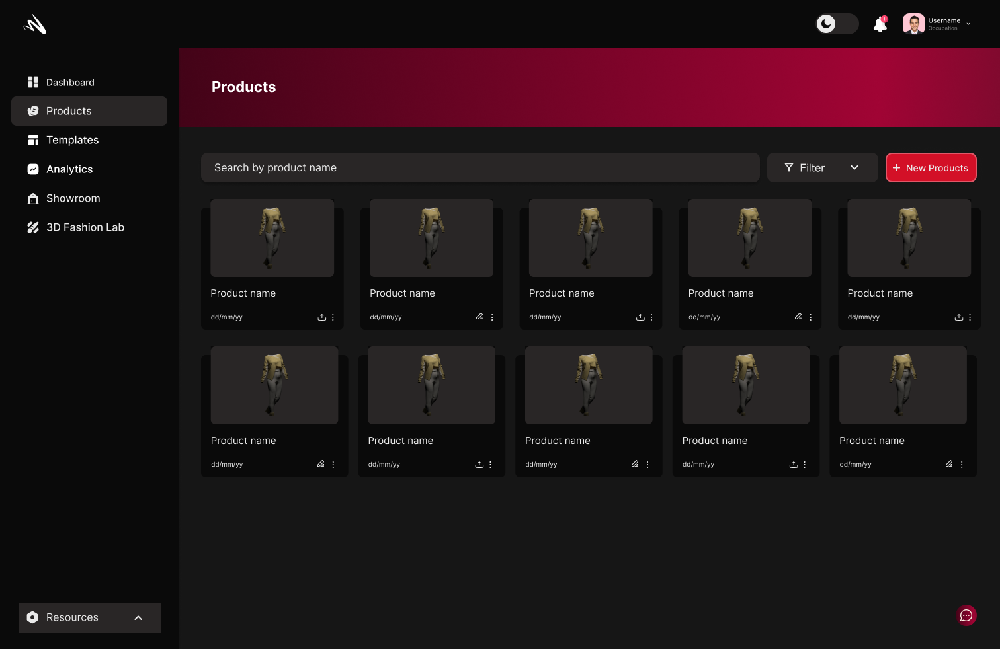

# Introduction <!-- omit in toc -->
Welcome to the MomentumX Documentation: Revolutionizing the Fashion Industry and Redefining Standards!

Experience the power of our comprehensive platform as we seamlessly integrate 3D design, showcase, and sustainable manufacturing. With augmented reality (AR) capabilities, we are reshaping the fashion industry and setting new benchmarks. This documentation is your guide to unlock the full potential of MomentumX and embark on an innovative fashion journey.

 - [Why Momentumx?](#why-mtumx)

 - [Getting started](#getting-started)

## Why mtumx?
 MomentumX offers businesses simplified optimization and deployment of 3D assets, versatile deployment options across various platforms including e-commerce, seamless workflow integration, future-proof technology with AR capabilities, and a strong focus on sustainability. By utilizing MomentumX, businesses can enhance their online presence, drive more sales, and create engaging shopping experiences for their customers.
## Getting started
We recognize that venturing into the realm of 3D can present its fair share of challenges. That's precisely why we have designed and developed MomentumX, along with a comprehensive documentation resource, to provide you with the necessary support and guidance throughout your journey.
<!-- To get started with MomentumX, [click here](getting_started.md). -->

<!-- ## The dashboard
When you first login to MomentumX, this is the page you will be greeted with:
<!-- 
<!-- [Dashboard](Images/dashboard.png) -->

### Let's create a new product!

To create a new product, click "New Product" on the right side of the dashboard. Enter a name in the designated field and click  "Create" to finish.

For detailed instructions, refer to our documentation on using the <a href="http://platform.mtumx.com/">configurator.</a>

### Upload Your 3D Assets 
No worries if you don't have 3D assets for MomentumX. You can either access our template folder or request a custom 3D item from our 3D fashion lab. We've got you covered!

The supported file formats for uploads are:
- glTF (GL Transmission Format)
- GLB (Binary glTF)

For detailed instructions, refer to our documentation on <a href="http://platform.mtumx.com/">Templates</a> and our <a href="http://platform.mtumx.com/">3D Fashion Lab</a>

### Edit Your 3D Assets
Upon uploading your 3D assets, they will be added to the Editor, allowing you to make changes as needed.

For detailed instructions, refer to our documentation on the <a href="http://platform.mtumx.com/">Editor.</a>

### Publish and Embed Your Project

Once you are satisfied with your product, simply click the "Publish" button to make it available to others.

For detailed instructions on how to <a href="http://platform.mtumx.com/">publish</a> and <a href="http://platform.mtumx.com/">embed your products</a>, please refer to our documentation.

