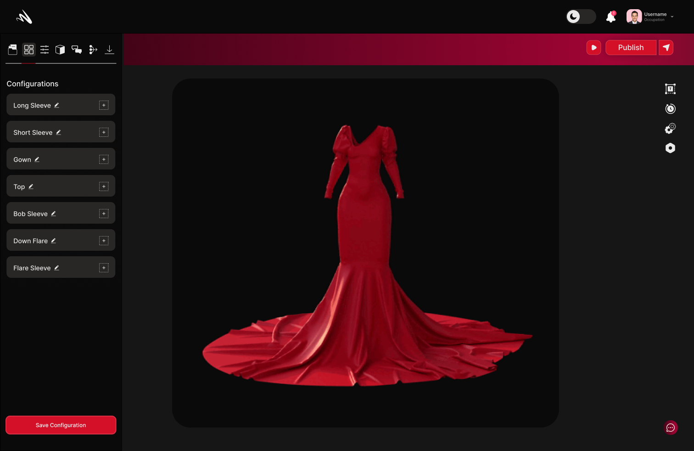

## Configuration
The 'Configurations' view is where you can create and manage configurations. The configurations view is where you manage the properties of your product that you can switch between. For example, if you want to create a product with different colors, you can create a configuration for each color and switch between them.

### Adding Mesh

In Momentumx, the "Adding Mesh" feature opens up a world of possibilities, allowing you to expand your design capabilities and create intricate 3D models with ease. With a robust set of mesh editing tools and functionalities, our platform empowers you to shape, manipulate, and refine meshes to bring your design visions to life.

### Adding AR

In Momentumx, the "Adding Mesh" feature opens up a world of possibilities, allowing you to expand your design capabilities and create intricate 3D models with ease. With a robust set of mesh editing tools and functionalities, our platform empowers you to shape, manipulate, and refine meshes to bring your design visions to life.
<!-- <clearly did not understood this > -->

### Choosing Presets

In Momentumx, the "Choosing Presets" feature simplifies and accelerates design workflows by offering a diverse range of pre-configured settings and templates, known as presets.Momentumx's presets allow users to bypass the need for manual configuration by providing pre-defined settings tailored for specific design requirements. With a single click, users can instantly apply presets that align with their intended design style, materials, lighting, rendering, or animation effects.

