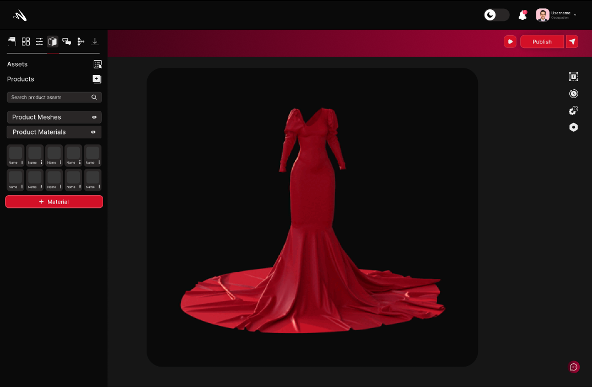
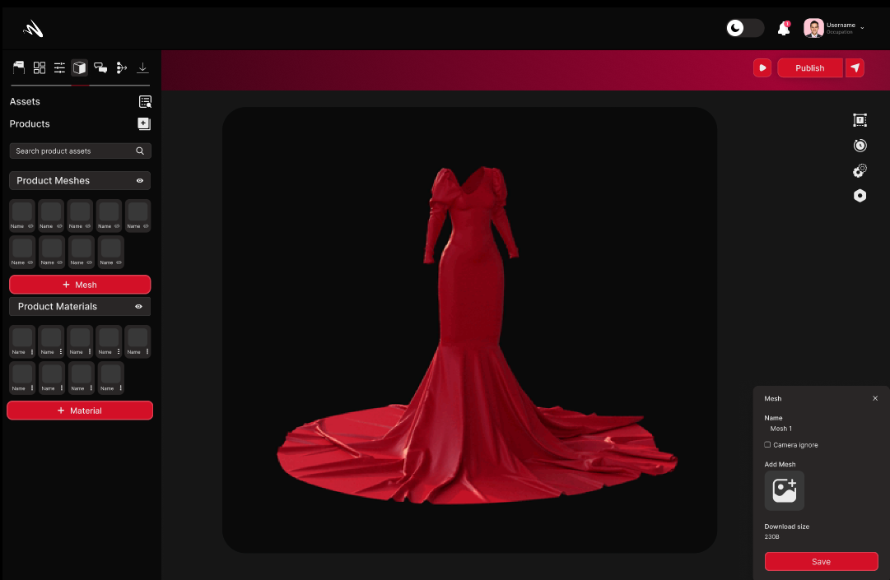
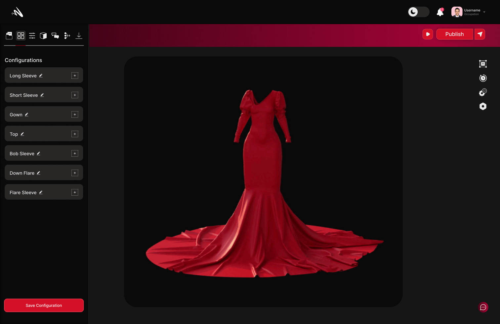
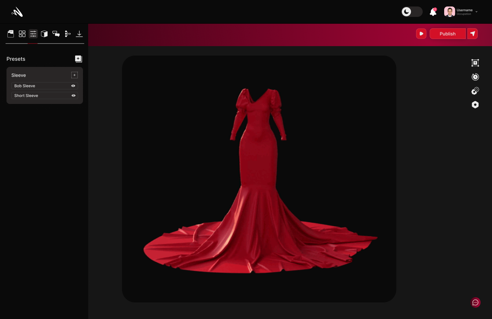
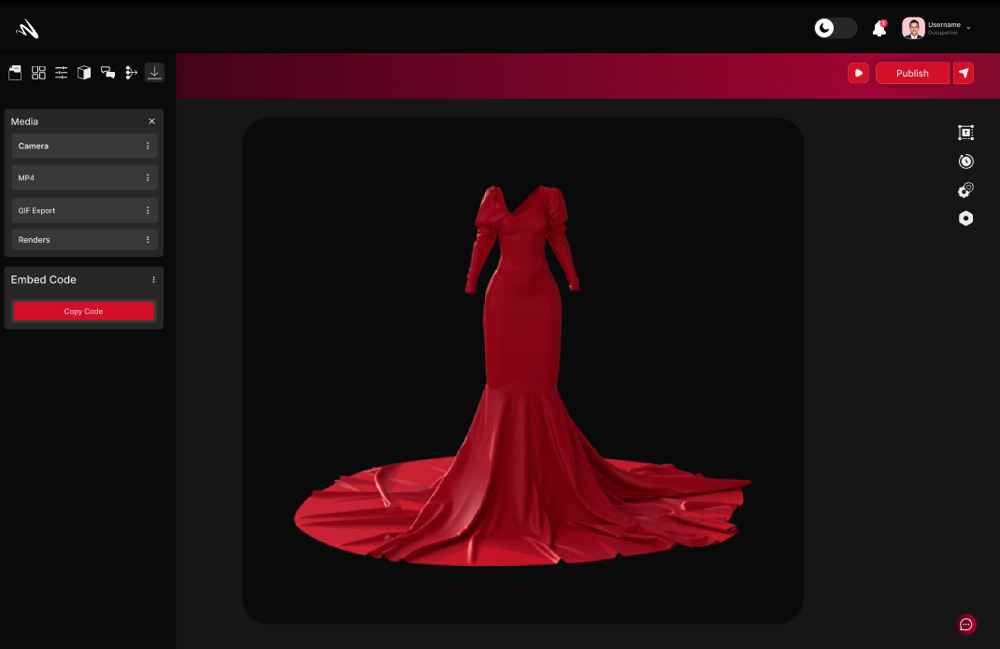

## Editing 
In Momentumx, the Editing feature provides a comprehensive set of tools and functionalities to fine-tune and refine your 3D designs. This feature empowers you to make precise adjustments, enhancements, and modifications to your models, ensuring they meet your creative vision and desired level of detail.

### Materials

The Material section in Momentumx unlocks a world of creative possibilities, offering an extensive library of materials that cater to every design need. From metals and plastics to fabrics and natural surfaces, our platform provides a diverse range of textures, finishes, and properties to bring your 3D designs to life. With just a few clicks, you can apply realistic materials that accurately replicate the look and feel of their real-world counterparts, ensuring visually stunning and immersive designs.

### Mesh
Content need to be addd

### Configuration
The 'Configurations' view is where you can create and manage configurations. The configurations view is where you manage the properties of your product that you can switch between. For example, if you want to create a product with different colors, you can create a configuration for each color and switch between them.

### Presets

The 'Presets' view is where you can create and manage presets. Presets are a set of rules that can be applied to a product to generate a new product. You can create presets for different purposes like generating a new product with a different color, or a new product with a different fabric, etc.

### Enviornments
<!-- not found clearly -->
### Camera 
The Camera Section in Momentumx empowers you to enhance the visual impact of your projects and unleash your creativity.Enrich your designs with captivating visuals that breathe life into your creations.Enable users to explore your 3D models from every angle, enhancing their understanding and appreciation of your designs.Momentumx's Media Section empowers you to elevate your 3D designs by incorporating captivating visuals, animations, and immersive experiences. 

