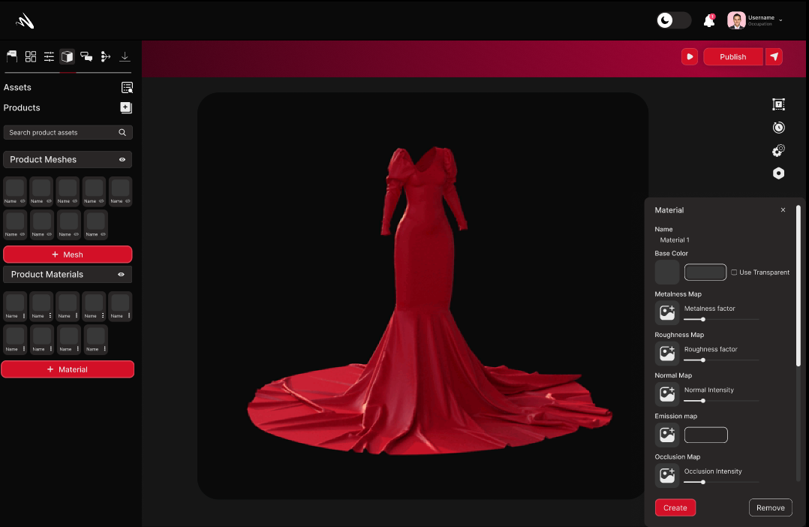
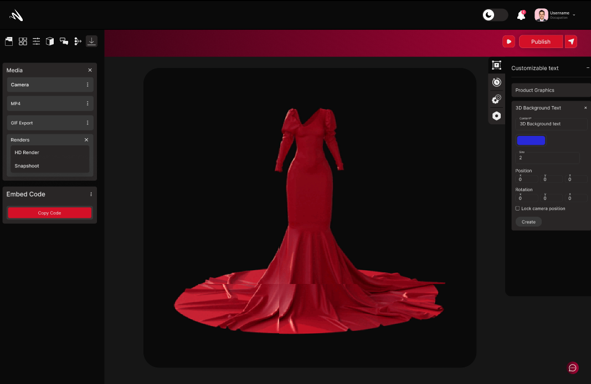

# Attributes 

Welcome to the Attributes section of MomentumX, your gateway to unlocking the full potential of our cutting-edge platform. In this section, we aim to provide you with a comprehensive overview of the robust functionalities and innovative features that set MomentumX apart.From intuitive user interfaces to powerful data analytics, each feature has been meticulously crafted to enhance your experience, optimize your workflows, and drive tangible results. Join us on this exploration of MomentumX's standout features and discover how they can accelerate your needs to new heights. Let's dive in and uncover the limitless possibilities together.

- [Configuration](#configuration.md)

- [Material](#material.md)

- [3D Scene](#material.md)

## Configuration
The 'Configurations' view is where you can create and manage configurations. The configurations view is where you manage the properties of your product that you can switch between. For example, if you want to create a product with different colors, you can create a configuration for each color and switch between them.

### Adding Mesh

In Momentumx, the "Adding Mesh" feature opens up a world of possibilities, allowing you to expand your design capabilities and create intricate 3D models with ease. With a robust set of mesh editing tools and functionalities, our platform empowers you to shape, manipulate, and refine meshes to bring your design visions to life.

### Adding AR

In Momentumx, the "Adding Mesh" feature opens up a world of possibilities, allowing you to expand your design capabilities and create intricate 3D models with ease. With a robust set of mesh editing tools and functionalities, our platform empowers you to shape, manipulate, and refine meshes to bring your design visions to life.
<!-- <clearly did not understood this > -->

### Choosing Presets

In Momentumx, the "Choosing Presets" feature simplifies and accelerates design workflows by offering a diverse range of pre-configured settings and templates, known as presets.Momentumx's presets allow users to bypass the need for manual configuration by providing pre-defined settings tailored for specific design requirements. With a single click, users can instantly apply presets that align with their intended design style, materials, lighting, rendering, or animation effects.

## Material

The Material section in Momentumx unlocks a world of creative possibilities, offering an extensive library of materials that cater to every design need. From metals and plastics to fabrics and natural surfaces, our platform provides a diverse range of textures, finishes, and properties to bring your 3D designs to life. With just a few clicks, you can apply realistic materials that accurately replicate the look and feel of their real-world counterparts, ensuring visually stunning and immersive designs.

### Base Color 

In Momentumx's Material section, the Base Color feature allows you to infuse your designs with vibrant hues and lifelike color representations. With just a few simple steps, you can select and apply base colors to your 3D models, instantly transforming them with a captivating visual appeal.

### Roughness
In Momentumx's Material section, the Roughness Factor provides precise control over the surface characteristics of your designs. By adjusting the roughness factor, you can achieve a wide range of surface textures, from smooth and glossy to rough and matte finishes. This feature allows you to emulate the physical properties of various materials, ensuring an accurate representation of how light interacts with different surfaces.

### Metalness
In Momentumx's Material section, the Metalness feature empowers you to achieve authentic and captivating metallic surfaces in your designs.The Metalness feature allows you to control the level of reflectivity and specular highlights, enabling you to create visually striking and true-to-life metallic finishes that enhance the overall aesthetic appeal of your 3D models.

### Normal Mep
In Momentumx's Material section, the Normal Map feature empowers you to add intricate surface details and enhance the realism of your designs. By utilizing normal maps, you can create the illusion of fine bumps, crevices, or surface imperfections on your 3D models. This feature adds depth and complexity to materials, resulting in a more convincing representation of real-world surfaces.

### Replace Texture
In Momentumx's Material section, the Replace Texture feature empowers you with the ability to seamlessly swap textures, providing unparalleled creative freedom and flexibility. With a simple click, you can replace an existing texture with a new one, instantly transforming the appearance and visual characteristics of your 3D models. 

### Tiling
In Momentumx's Material section, the Tiling feature allows you to effortlessly replicate and adjust the scale of textures, enabling seamless and consistent designs.By utilizing the Tiling feature in Momentumx, you can achieve flawless and visually appealing textures that enhance the overall quality of your designs.

## 3D Scene
 Momentumx's 3D Scene functionality enables you to create immersive environments that transport your audience into captivating virtual worlds. With powerful tools and capabilities, Momentumx empowers you to design and construct rich 3D scenes that bring your ideas to life with unparalleled realism and interactivity. 

### Lighting

Momentumx's 3D Scene section, the Lighting feature enables you to set the mood, evoke emotions, and enhance the realism of your virtual environments.Momentumx empowers you to incorporate dynamic lighting systems into your 3D scenes. Adjust the position, intensity, and color of light sources to simulate the changing effects of sunlight throughout the day or create dramatic artificial lighting setups.

<!-- <image not found properly> -->

### Background Colors/Image
In Momentumx's 3D Scene section, the Background Colors/Image feature allows you to set the stage and create immersive environments by customizing the background of your scenes. With the ability to choose vibrant colors or import captivating images, you can establish the perfect backdrop that complements your design and enhances the overall atmosphere. 

### Product Graphics
In Momentumx, the Product Graphics feature serves as a gateway to elevating the visual appeal and realism of your designs. With a comprehensive set of tools and functionalities, this feature allows you to enhance your 3D models with high-quality graphics, bringing them to life with stunning visual details, textures, and effects. 

### Background Text
Momentumx's Background Text feature offers a powerful way to enhance visual communication and provide additional context to your designs. By incorporating text elements into the background of your scenes, you can convey important information, highlight key features, or create a cohesive visual narrative.

### Anotation and Comments 
In Momentumx, the Anotation and Comments feature revolutionizes the way designers, clients, and team members collaborate and communicate on projects. This powerful tool streamlines the feedback process, fosters collaboration, and ensures that everyone involved in a project is on the same page.By streamlining the feedback process, fostering collaborative iteration, and enabling contextual discussions, this feature ensures that projects progress smoothly, design decisions are well-informed, and all stakeholders feel engaged and valued.

### Asset Library
In Momentumx, the Asset Library is a powerful feature that provides a centralized repository for all your digital resources. It serves as a comprehensive collection of assets, including images, videos, audio files, 3D models, icons, and more, making it easy to manage and access the resources you need for your projects.

### Camera Positions

In Momentumx, the Camera Positions feature offers you unparalleled control over how your designs are viewed and experienced. With a range of camera manipulation tools and options, you can effortlessly capture and present your designs from various angles, perspectives, and focal lengths, enabling you to showcase their finest details and unique features.

### History
 Content 

 

### HD Render
 Momentumx's HD Render feature takes your design visuals to the next level, delivering stunning high-definition imagery that showcases intricate detail and unparalleled realism. With advanced rendering capabilities and cutting-edge technology, Momentumx allows you to produce visuals of the highest quality, surpassing the expectations of both clients and viewers. 

