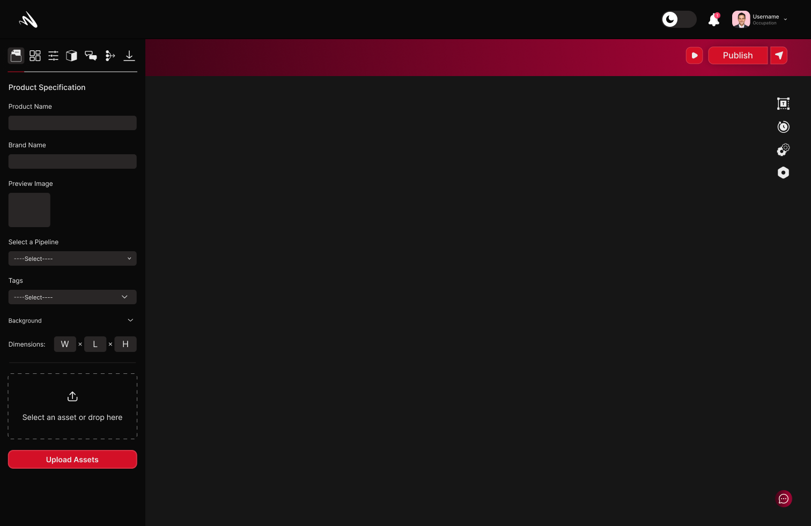

# Getting Started
## The dashboard
When you first login to MomentumX, this is the page you will be greeted with:

## The product view
If you want to check the list of all products available, go to the products tab in the sidebar.

## Analytics
To view statistics and analytics about your products, go to the analytics tab:

## Creating an asset
To create a new asset, go to the dashboard and click on the `Create Asset` button:

### Presets
You can also create presets in the asset view:

