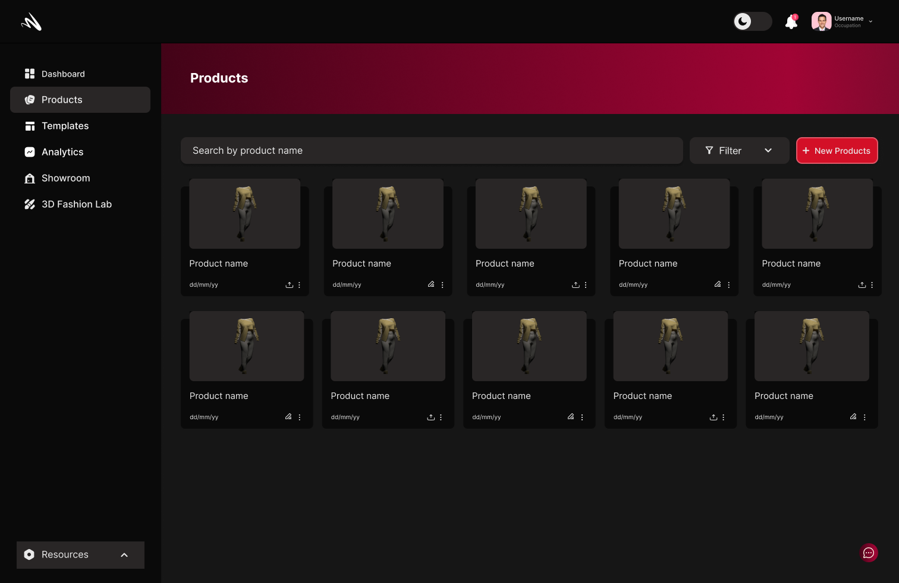

## Landing Page

At Momentumx,we've created a comprehensive platform designed to streamline your documentation process and supercharge your productivity.
Our landing page serves as your gateway to a world of knowledge, collaboration, and innovation.
### Dashboard
Your Dashboard is the first page you see when you log in to Momentumx. It is the main hub for all your activities on the platform. You can access all the features of the platform from the dashboard. The dashbord displays your recent products, etc.

### Products

Selecting the 'Products' view on the side bar will take you to the products page. Here you can view all the products you have created. You can also create new products from this page.

### Templates

MomentumX offers a wide range of templates to choose from. You can either use our templates or create your own templates that you can use to create your products.

### Analysis

The Analytics view is where you can view detailed statistics about your products. You can view the number of products you have created, the number of presets you have created, the number of assets you have created, user interaction, user engagement, etc.

### 3D Fashion Lab

The 3D Fashion Lab is where you can create your 3D fashion products. Just fill out the form given and upload your sketches or designs, and we'll send you a 3D design based on your vision.

