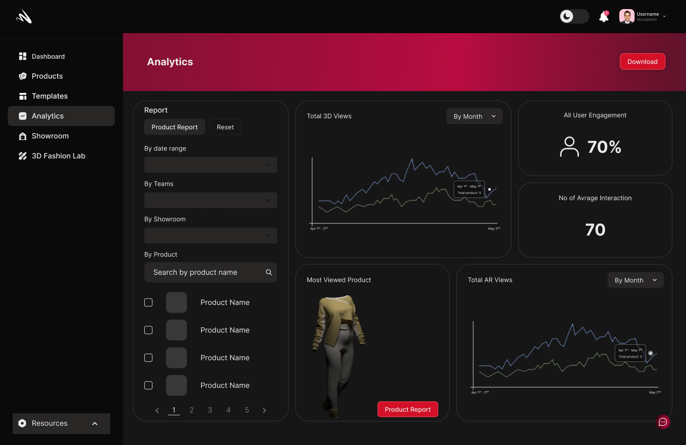
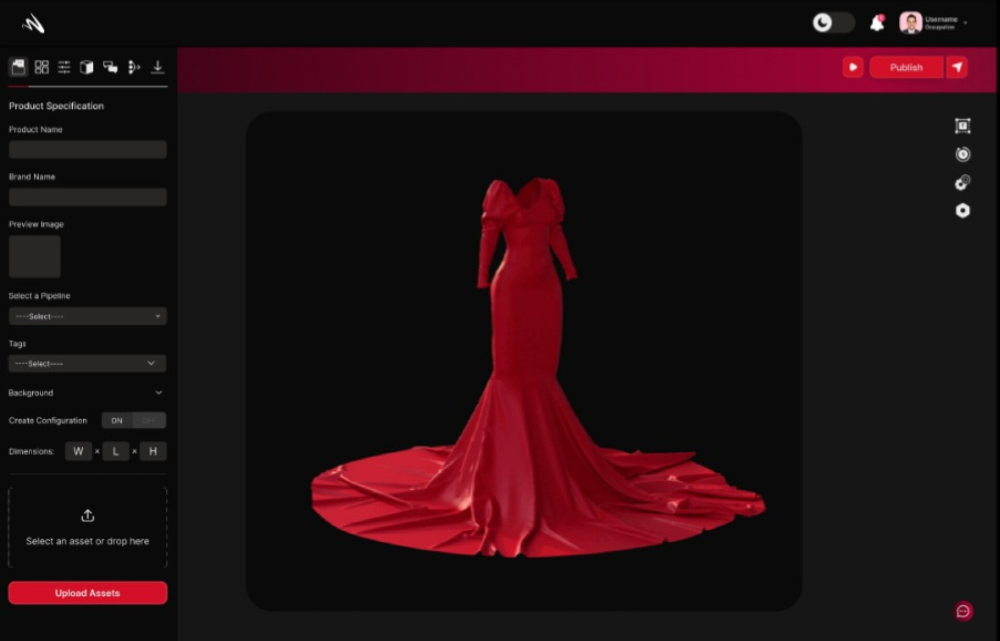
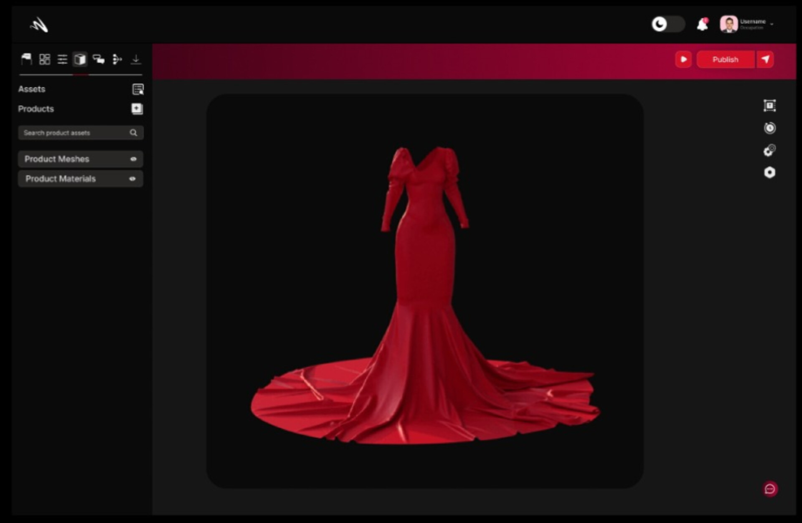

# Navigate The Interface <!-- omit in toc -->
Welcome to Momentumx, where we've designed our interface with simplicity and efficiency in mind. Navigating through our platform is a breeze, allowing you to focus on what truly matters: creating exceptional documentation. Let's explore the key sections of our interface that will empower you to navigate with ease and make the most out of your documentation journey.

 - [Landing Page](#landing-page)

 - [Editor](#editor.md)
## Landing Page

At Momentumx,we've created a comprehensive platform designed to streamline your documentation process and supercharge your productivity.
Our landing page serves as your gateway to a world of knowledge, collaboration, and innovation.
### Dashboard
Your Dashboard is the first page you see when you log in to Momentumx. It is the main hub for all your activities on the platform. You can access all the features of the platform from the dashboard. The dashbord displays your recent products, etc.

### Products

Selecting the 'Products' view on the side bar will take you to the products page. Here you can view all the products you have created. You can also create new products from this page.

### Templates

MomentumX offers a wide range of templates to choose from. You can either use our templates or create your own templates that you can use to create your products.

### Analysis

The Analytics view is where you can view detailed statistics about your products. You can view the number of products you have created, the number of presets you have created, the number of assets you have created, user interaction, user engagement, etc.

### 3D Fashion Lab

The 3D Fashion Lab is where you can create your 3D fashion products. Just fill out the form given and upload your sketches or designs, and we'll send you a 3D design based on your vision.

## Editor 
At Momentumx, we understand the importance of a robust and intuitive editor when it comes to 3D design. Our Editor section is specifically tailored to meet the unique needs of designers and creators like you. Take a look at the powerful features and capabilities that make our Editor stand out.Whether you're an experienced designer or just starting your 3D design journey, our platform provides the tools and capabilities you need to bring your imagination to life. 

### Product Specification

Momentumx's product specifications go beyond the basics, providing a comprehensive suite of features and capabilities tailored to elevate your 3D design projects. Immerse yourself in a world of intuitive design tools, realistic renderings, seamless collaboration, and secure storage.

### Configuration

The 'Configurations' view is where you can create and manage configurations. The configurations view is where you manage the properties of your product that you can switch between. For example, if you want to create a product with different colors, you can create a configuration for each color and switch between them.

### Presets

The 'Presets' view is where you can create and manage presets. Presets are a set of rules that can be applied to a product to generate a new product. You can create presets for different purposes like generating a new product with a different color, or a new product with a different fabric, etc.

### Material tab
Momentumx's Material Tab provides you with a wealth of options and capabilities to enhance your designs and unlock new creative possibilities. Explore the exciting features and functionalities of our Material Tab

### Collaboration

Momentumx's Collaboration Section empowers your team to collaborate effectively, share ideas, and collectively drive the success of your 3D design projects. Foster a culture of teamwork, innovation, and creativity with our powerful collaboration features, bringing your designs to new heights of excellence.

### Media

The Media Section in Momentumx empowers you to enhance the visual impact of your projects and unleash your creativity.Enrich your designs with captivating visuals that breathe life into your creations.Enable users to explore your 3D models from every angle, enhancing their understanding and appreciation of your designs.Momentumx's Media Section empowers you to elevate your 3D designs by incorporating captivating visuals, animations, and immersive experiences. 

### Publish

Momentumx's Publishing Section empowers you to share your documentation effectively, ensuring it reaches your intended audience while maintaining a seamless and engaging user experience. Publish your documentation in various formats, customize its appearance, optimize it for search engines, and gain valuable insights into user behavior. Maximize the impact of your documentation by leveraging the robust publishing features within Momentumx.

