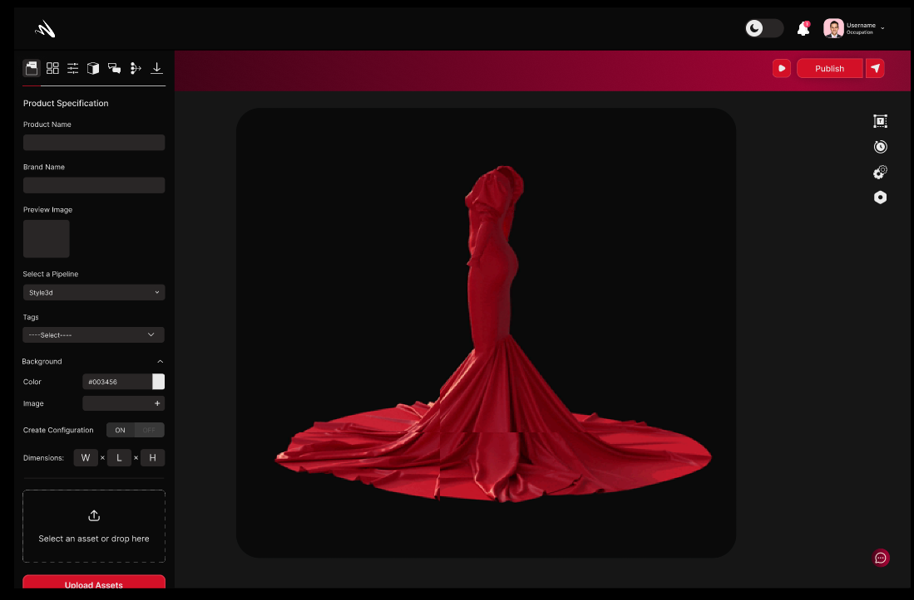
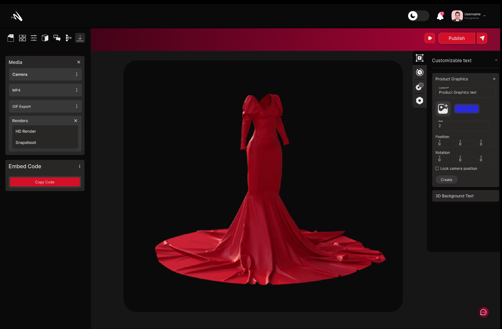
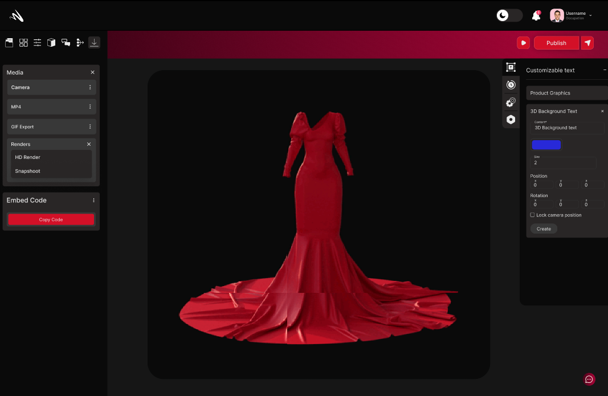
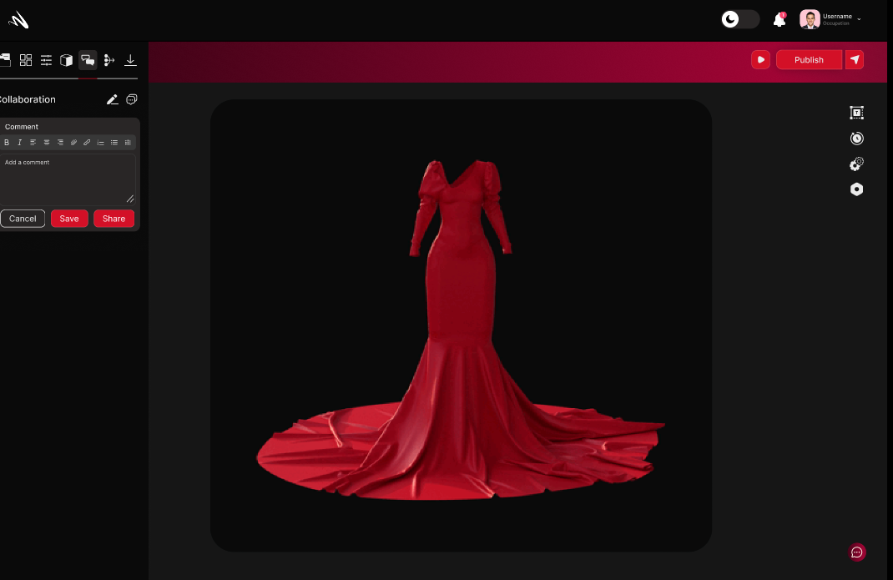
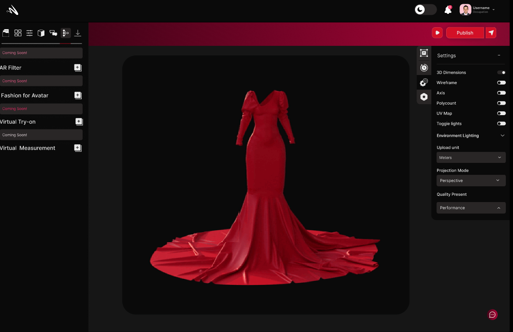
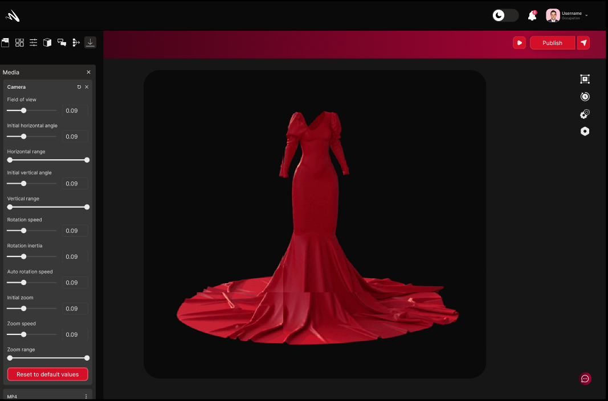
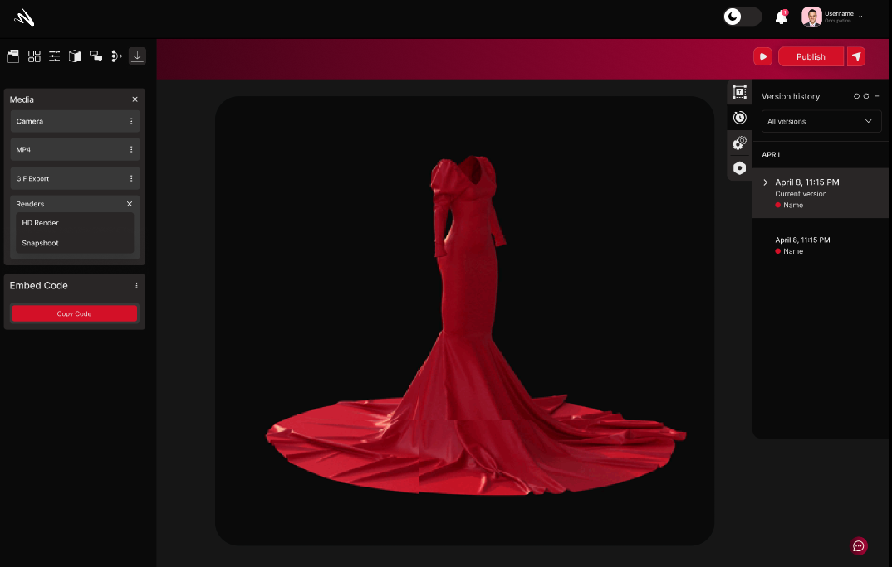
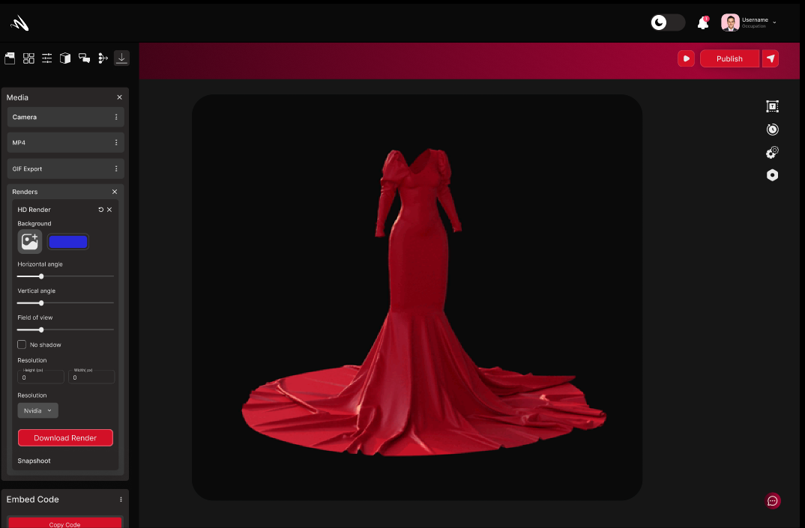

## 3D Scene
 Momentumx's 3D Scene functionality enables you to create immersive environments that transport your audience into captivating virtual worlds. With powerful tools and capabilities, Momentumx empowers you to design and construct rich 3D scenes that bring your ideas to life with unparalleled realism and interactivity. 

### Lighting

Momentumx's 3D Scene section, the Lighting feature enables you to set the mood, evoke emotions, and enhance the realism of your virtual environments.Momentumx empowers you to incorporate dynamic lighting systems into your 3D scenes. Adjust the position, intensity, and color of light sources to simulate the changing effects of sunlight throughout the day or create dramatic artificial lighting setups.

<!-- <image not found properly> -->

### Background Colors/Image
In Momentumx's 3D Scene section, the Background Colors/Image feature allows you to set the stage and create immersive environments by customizing the background of your scenes. With the ability to choose vibrant colors or import captivating images, you can establish the perfect backdrop that complements your design and enhances the overall atmosphere. 

### Product Graphics
In Momentumx, the Product Graphics feature serves as a gateway to elevating the visual appeal and realism of your designs. With a comprehensive set of tools and functionalities, this feature allows you to enhance your 3D models with high-quality graphics, bringing them to life with stunning visual details, textures, and effects. 

### Background Text
Momentumx's Background Text feature offers a powerful way to enhance visual communication and provide additional context to your designs. By incorporating text elements into the background of your scenes, you can convey important information, highlight key features, or create a cohesive visual narrative.

### Anotation and Comments 
In Momentumx, the Anotation and Comments feature revolutionizes the way designers, clients, and team members collaborate and communicate on projects. This powerful tool streamlines the feedback process, fosters collaboration, and ensures that everyone involved in a project is on the same page.By streamlining the feedback process, fostering collaborative iteration, and enabling contextual discussions, this feature ensures that projects progress smoothly, design decisions are well-informed, and all stakeholders feel engaged and valued.

### Asset Library
In Momentumx, the Asset Library is a powerful feature that provides a centralized repository for all your digital resources. It serves as a comprehensive collection of assets, including images, videos, audio files, 3D models, icons, and more, making it easy to manage and access the resources you need for your projects.

### Camera Positions

In Momentumx, the Camera Positions feature offers you unparalleled control over how your designs are viewed and experienced. With a range of camera manipulation tools and options, you can effortlessly capture and present your designs from various angles, perspectives, and focal lengths, enabling you to showcase their finest details and unique features.

### History
 Content 

 

### HD Render
 Momentumx's HD Render feature takes your design visuals to the next level, delivering stunning high-definition imagery that showcases intricate detail and unparalleled realism. With advanced rendering capabilities and cutting-edge technology, Momentumx allows you to produce visuals of the highest quality, surpassing the expectations of both clients and viewers. 

