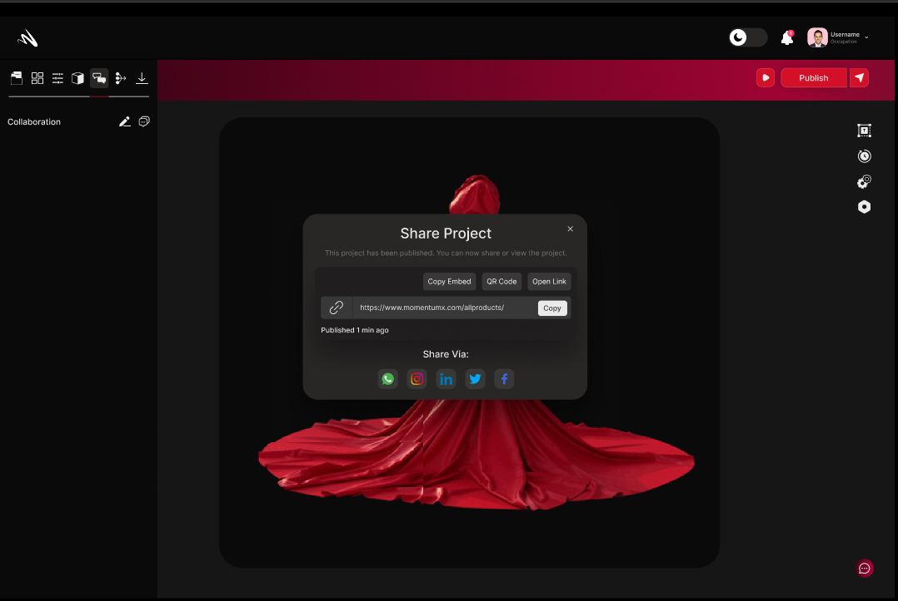

## Sharing
In Momentumx, the Sharing feature enables you to effortlessly collaborate and showcase your 3D designs with others. Whether you're working with team members, clients, or stakeholders, this feature provides a seamless way to share your creations, gather feedback, and promote your work. 

### Publish Your Project 
In Momentumx, the Publish Your Project feature allows you to share your 3D creations with the world in various formats and platforms. Whether you want to showcase your designs on websites, social media, or other digital channels, this feature provides a seamless and versatile publishing process.
From exporting high-quality images, creating interactive 3D models, and animated presentations to embedding widgets, integrating with VR, and facilitating collaborative presentations, this feature empowers you to showcase your designs effectively and engage your audience on different digital channels. 

### Download
In Momentumx, the Download feature enables you to conveniently access and retrieve your 3D designs at any time, from anywhere. Whether you need to work offline, transfer your designs to other software, or store backups for safekeeping, this feature provides a seamless way to download your projects.

<!-- Image not found , need this -->

### Styling

### Web AR
With the Web AR feature in Momentumx, you can revolutionize the way users experience and interact with your 3D designs. By leveraging the power of augmented reality in a web browser, you can create engaging, interactive, and memorable experiences that captivate your audience and leave a lasting impression. Embrace the potential of Web AR in Momentumx and elevate your 3D creations to new heights of innovation and engagement.

