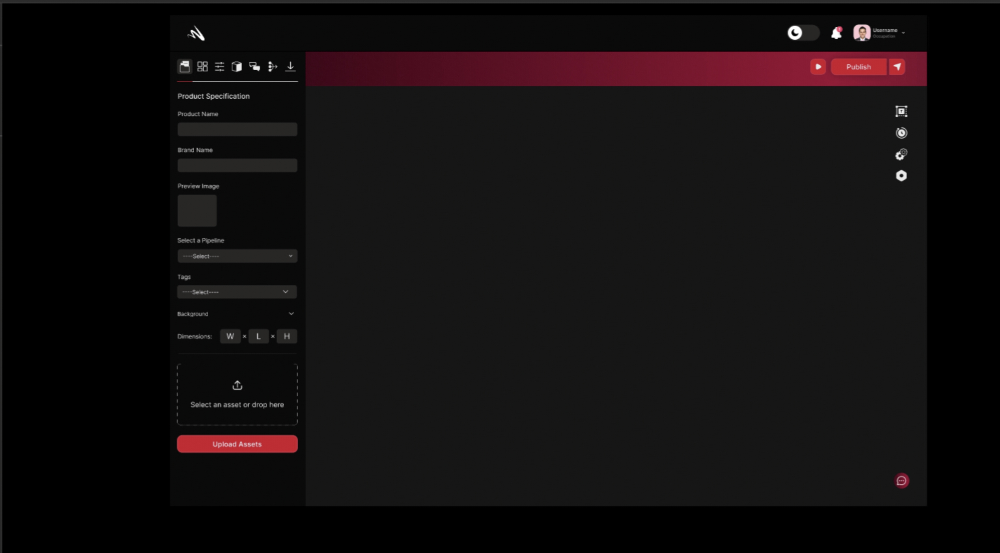
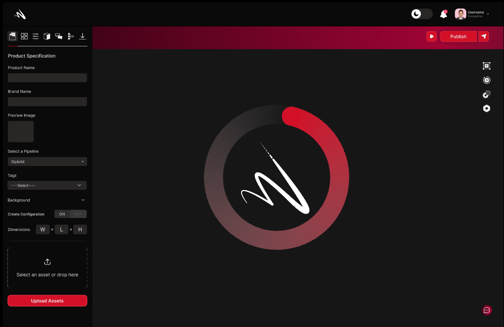

## Uploading
Momentumx's Uploading feature provides a seamless and efficient way to add and manage your assets within the platform. Whether you're uploading images, videos, audio files, or any other digital resources, this feature simplifies the process, ensuring your assets are easily accessible, organized, and ready to be utilized in your creative projects.

### Upload Your 3D Assets
In Momentumx, the "Upload Your 3D Assets" feature offers a seamless and efficient way to incorporate your 3D resources into the platform. Whether you're uploading complex 3D models, textured objects, or other 3D assets, this feature simplifies the process, ensuring that your creations are easily accessible, well-organized, and ready to be utilized in your projects.

### Prepare Your 3D Assets
With the "Prepare Your 3D Assets" feature in Momentumx, you can optimize, refine, and fine-tune your 3D resources for seamless integration and optimal performance. By formatting, optimizing geometry, enhancing textures and materials, scaling assets, generating LODs, setting up rigging and animation, and performing validation checks, this feature ensures that your 3D assets are ready to shine within Momentumx, bringing your creative visions to life with ease and excellence.

### How to Texture

### UV Mapping
UV Mapping feature empowers you to achieve precise texture placement on your 3D models, bringing them to life with realistic and detailed surface appearance. UV mapping is a fundamental technique in 3D computer graphics that allows you to accurately apply textures, colors, and patterns onto the surfaces of your models.
<!-- <image not found> -->

### Tiled Textures
<!-- [click here](workflow.md) -->