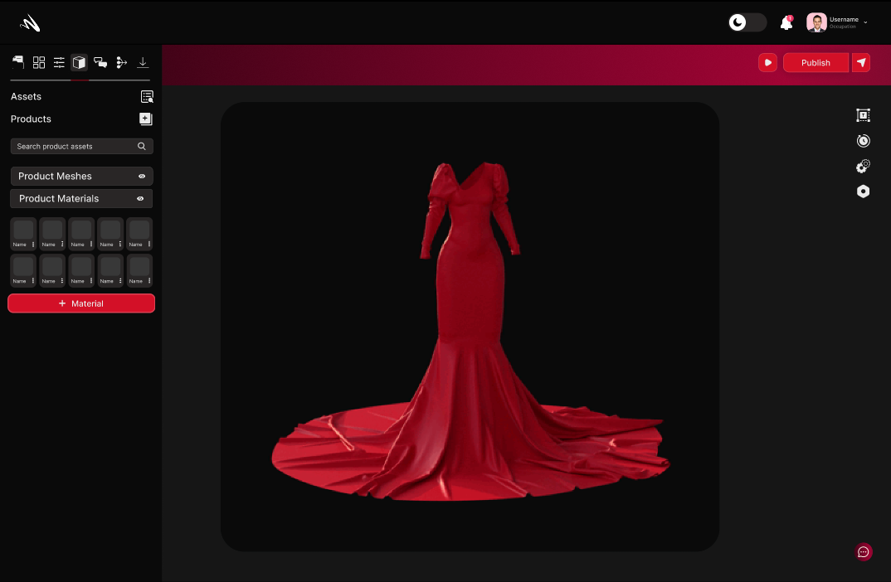
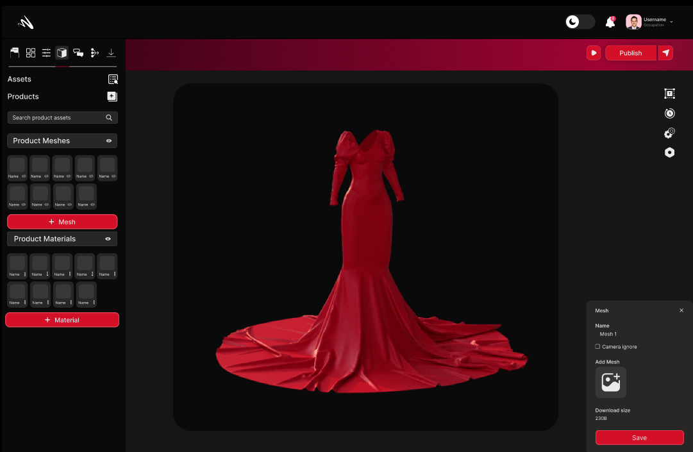
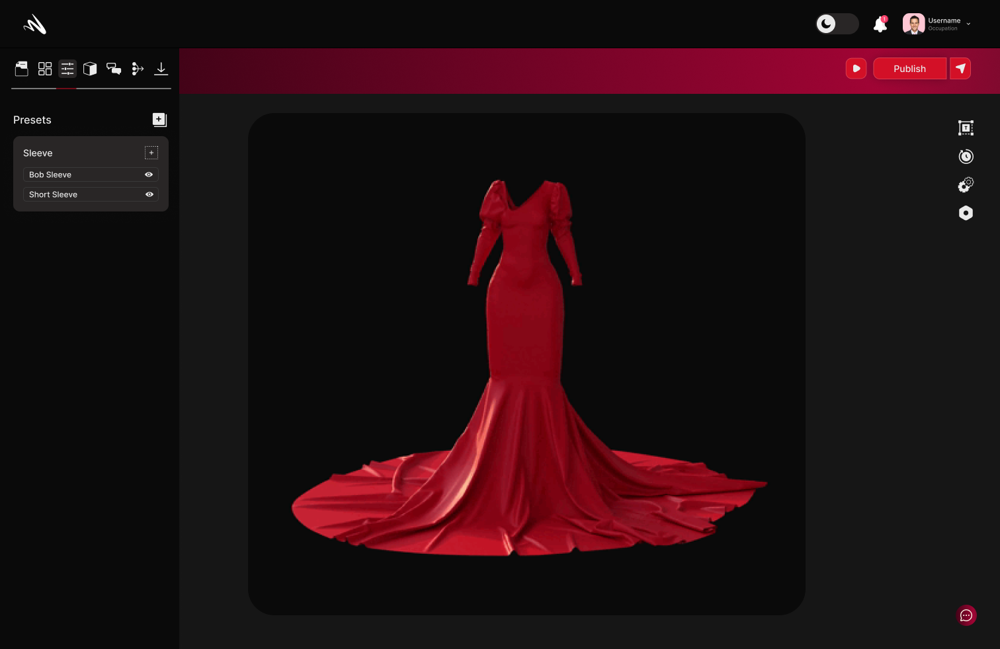

# Workflow 
Welcome to the Workflow section of Momentumx, The Workflow feature is designed to empower you with tools and functionalities that enhance collaboration, optimize productivity, and bring your creative ideas to life seamlessly.With the Workflow feature in Momentumx, you have the tools to streamline your creative process, foster collaboration, and optimize productivity
 - [Uploading](#uploading.md)

 - [Editing](#editing.md)

 - [Sharing](#Sharing.md)

 
## Uploading
Momentumx's Uploading feature provides a seamless and efficient way to add and manage your assets within the platform. Whether you're uploading images, videos, audio files, or any other digital resources, this feature simplifies the process, ensuring your assets are easily accessible, organized, and ready to be utilized in your creative projects.

### Upload Your 3D Assets
In Momentumx, the "Upload Your 3D Assets" feature offers a seamless and efficient way to incorporate your 3D resources into the platform. Whether you're uploading complex 3D models, textured objects, or other 3D assets, this feature simplifies the process, ensuring that your creations are easily accessible, well-organized, and ready to be utilized in your projects.

### Prepare Your 3D Assets
With the "Prepare Your 3D Assets" feature in Momentumx, you can optimize, refine, and fine-tune your 3D resources for seamless integration and optimal performance. By formatting, optimizing geometry, enhancing textures and materials, scaling assets, generating LODs, setting up rigging and animation, and performing validation checks, this feature ensures that your 3D assets are ready to shine within Momentumx, bringing your creative visions to life with ease and excellence.

### How to Texture

With the "Prepare Your 3D Assets" feature in Momentumx, you can optimize, refine, and fine-tune your 3D resources for seamless integration and optimal performance. By formatting, optimizing geometry, enhancing textures and materials, scaling assets, generating LODs, setting up rigging and animation, and performing validation checks, this feature ensures that your 3D assets are ready to shine within Momentumx, bringing your creative visions to life with ease and excellence.

### UV Mapping
UV Mapping feature empowers you to achieve precise texture placement on your 3D models, bringing them to life with realistic and detailed surface appearance. UV mapping is a fundamental technique in 3D computer graphics that allows you to accurately apply textures, colors, and patterns onto the surfaces of your models.

<!-- <image not found> -->

### Tiled Textures

UV Mapping feature empowers you to achieve precise texture placement on your 3D models, bringing them to life with realistic and detailed surface appearance. UV mapping is a fundamental technique in 3D computer graphics that allows you to accurately apply textures, colors, and patterns onto the surfaces of your models.

<!-- [click here](workflow.md) -->
## Editing 
In Momentumx, the Editing feature provides a comprehensive set of tools and functionalities to fine-tune and refine your 3D designs. This feature empowers you to make precise adjustments, enhancements, and modifications to your models, ensuring they meet your creative vision and desired level of detail.

### Materials

The Material section in Momentumx unlocks a world of creative possibilities, offering an extensive library of materials that cater to every design need. From metals and plastics to fabrics and natural surfaces, our platform provides a diverse range of textures, finishes, and properties to bring your 3D designs to life. With just a few clicks, you can apply realistic materials that accurately replicate the look and feel of their real-world counterparts, ensuring visually stunning and immersive designs.

### Mesh
Content need to be addd

### Configuration
The 'Configurations' view is where you can create and manage configurations. The configurations view is where you manage the properties of your product that you can switch between. For example, if you want to create a product with different colors, you can create a configuration for each color and switch between them.

### Presets

The 'Presets' view is where you can create and manage presets. Presets are a set of rules that can be applied to a product to generate a new product. You can create presets for different purposes like generating a new product with a different color, or a new product with a different fabric, etc.

### Enviornments
<!-- not found clearly -->
The 'Presets' view is where you can create and manage presets. Presets are a set of rules that can be applied to a product to generate a new product. You can create presets for different purposes like generating a new product with a different color, or a new product with a different fabric, etc.

### Camera 
The Camera Section in Momentumx empowers you to enhance the visual impact of your projects and unleash your creativity.Enrich your designs with captivating visuals that breathe life into your creations.Enable users to explore your 3D models from every angle, enhancing their understanding and appreciation of your designs.Momentumx's Media Section empowers you to elevate your 3D designs by incorporating captivating visuals, animations, and immersive experiences. 

## Sharing
In Momentumx, the Sharing feature enables you to effortlessly collaborate and showcase your 3D designs with others. Whether you're working with team members, clients, or stakeholders, this feature provides a seamless way to share your creations, gather feedback, and promote your work. 

### Publish Your Project 
In Momentumx, the Publish Your Project feature allows you to share your 3D creations with the world in various formats and platforms. Whether you want to showcase your designs on websites, social media, or other digital channels, this feature provides a seamless and versatile publishing process.
From exporting high-quality images, creating interactive 3D models, and animated presentations to embedding widgets, integrating with VR, and facilitating collaborative presentations, this feature empowers you to showcase your designs effectively and engage your audience on different digital channels. 

### Download
In Momentumx, the Download feature enables you to conveniently access and retrieve your 3D designs at any time, from anywhere. Whether you need to work offline, transfer your designs to other software, or store backups for safekeeping, this feature provides a seamless way to download your projects.

<!-- Image not found , need this -->

### Styling

### Web AR
With the Web AR feature in Momentumx, you can revolutionize the way users experience and interact with your 3D designs. By leveraging the power of augmented reality in a web browser, you can create engaging, interactive, and memorable experiences that captivate your audience and leave a lasting impression. Embrace the potential of Web AR in Momentumx and elevate your 3D creations to new heights of innovation and engagement.

### Web AR
With the Web AR feature in Momentumx, you can revolutionize the way users experience and interact with your 3D designs. By leveraging the power of augmented reality in a web browser, you can create engaging, interactive, and memorable experiences that captivate your audience and leave a lasting impression. Embrace the potential of Web AR in Momentumx and elevate your 3D creations to new heights of innovation and engagement.

